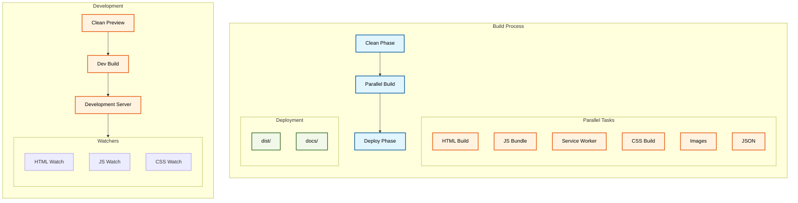
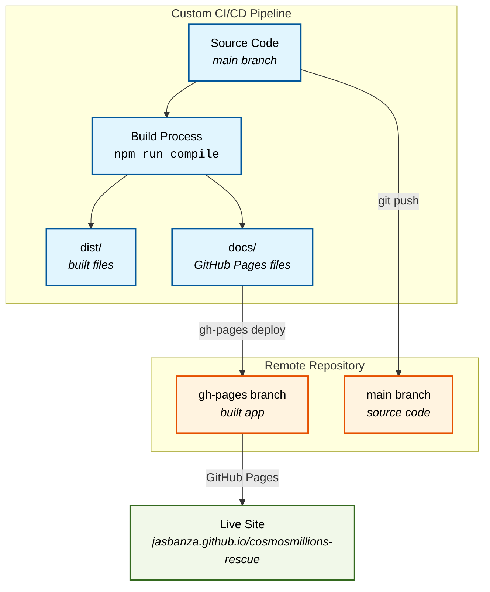

# cosmosmillions-rescue
#### dApp to withdraw from cosmosmillions on lum network - https://pro.osmosis.zone/
#### 👉 **[click here to use the dApp](https://jasbanza.github.io/cosmosmillions-rescue/)**
_📌 don't forget to bookmark!_
### Features:
- Pull list of connected wallet's deposits
- Withdraw specific deposits
- ✅ Keplr
- ✅ Ledger
## Custom Hosting:
Everything in the ./dist folder is ready to be hosted on a web server. Simply copy and paste and it should work.
## Development Setup
#### Install project and dev dependencies:
```bash
npm install
```
#### For development:
```bash
npm run dev
```
- Deploys a localhost HTTP server ()
- Monitors JS, CSS & HTML and bundles changes (outputs to ./preview which is included in .gitignore)
#### Compile:
```bash
npm run compile
```
- Bundles js for browser, outputs to:
- ./dist (included in .gitignore)
- ./docs (use for github pages)

## Deployment Setup
First-time deployment requires installing gh-pages:
```bash
npm install gh-pages --save-dev
```

Update package.json scripts:
```json
"scripts": {
  "predeploy": "npm run compile",
  "deploy": "gh-pages -d docs",
  "start": "react-scripts start",
  "build": "react-scripts build"
}
```

Set homepage in package.json:
```json
{
  "homepage": "https://jasbanza.github.io/cosmosmillions-rescue",
  ...
}
```

Deploy to GitHub Pages:
```bash
npm run deploy
```

Configure GitHub Pages:
1. Go to repository Settings → Pages
2. Select branch: gh-pages
3. Save changes

Your dApp will be live at https://jasbanza.github.io/cosmosmillions-rescue



